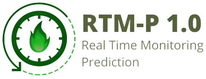

## Introduction
RTM-P (Realtime Monitoring Prediction) is a technology based on machine learning system using web base.

## Libraries Used

* numpy
* pandas
* matplotlib
* geopandas
* keras
* tensorflow
* streamlit

## How to Run
* Install a package similar with requirements.txt using "pip install -r requirements.txt" in your terminal.
* After that, you can write "streamlit run main.py" to run this app.

## Acknowledgements
It was created by [Erwin Fernnda](https://github.com/erwin.ngitung) as a staff Machine Learning Engineer Center of PT.Medco Energi International Indonesia.
